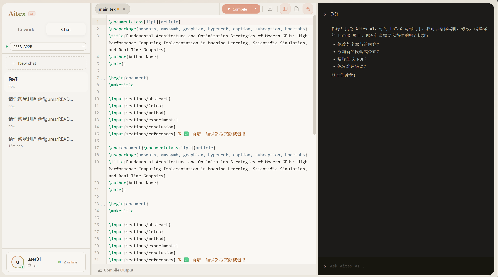

<p align="center">
  
  
  
</p>

<p align="center">
<pre align="center">
 █████╗ ██╗████████╗███████╗██╗  ██╗
██╔══██╗██║╚══██╔══╝██╔════╝╚██╗██╔╝
███████║██║   ██║   █████╗   ╚███╔╝
██╔══██║██║   ██║   ██╔══╝   ██╔██╗
██║  ██║██║   ██║   ███████╗██╔╝ ██╗
╚═╝  ╚═╝╚═╝   ╚═╝   ╚══════╝╚═╝  ╚═╝
</pre>
</p>

<p align="center">
  <strong>AI 驱动的协作式 LaTeX 在线编辑器</strong><br />
  类似 Overleaf 的自托管方案，内置 AI 助手，支持多人实时协作
</p>

<p align="center">
  
</p>
<p align="center"><sub>三栏布局：文件树 + AI 对话历史 | CodeMirror LaTeX 编辑器 | AI 助手面板</sub></p>

---

## 核心能力

<table>
<tr>
<td align="center" width="25%">
<br />
<br />
<strong>Write</strong><br />
<sub>自然语言生成 LaTeX 内容</sub>
<br /><br />
</td>
<td align="center" width="25%">
<br />
<br />
<strong>Edit</strong><br />
<sub>精准编辑项目中的任意文件</sub>
<br /><br />
</td>
<td align="center" width="25%">
<br />
<br />
<strong>Compile</strong><br />
<sub>一键编译并预览 PDF 文档</sub>
<br /><br />
</td>
<td align="center" width="25%">
<br />
<br />
<strong>Fix</strong><br />
<sub>自动诊断并修复编译错误</sub>
<br /><br />
</td>
</tr>
</table>

---

## 功能特性

### LaTeX 编辑器

- **CodeMirror 6** — 专业的 LaTeX 语法高亮，支持 `.tex`, `.sty`, `.cls` 文件
- **智能补全** — `\begin{}`/`\end{}` 环境补全、`\ref{}`/`\cite{}` 交叉引用补全、LaTeX 命令补全
- **代码片段** — 内置常用 LaTeX 模板片段，快速插入公式、表格、图片环境
- **代码折叠** — 按 `\section`/`\begin`...`\end` 块折叠
- **多编译器** — pdfLaTeX / XeLaTeX / LuaLaTeX / Latexmk 一键切换，AI 根据编译器自动调整语言策略

### AI 助手

- **流式对话 (SSE)** — 基于 OpenAI 兼容 API，支持实时流式输出
- **多模型切换** — Qwen3-VL-235B Instruct / Thinking 等多个模型可选
- **文件操作工具** — AI 可直接 `read_file` / `write_file` / `edit_file` / `delete_file` / `rename_file` / `compile_project`
- **变更审查** — 每次 AI 修改文件后，以 Diff 视图展示变更，用户可 Accept / Reject
- **权限感知** — AI 根据用户身份（Owner / Collaborator）自动调整可用工具，避免越权操作
- **上下文注入** — 自动注入项目文件列表、编译器类型、用户权限到系统提示
- **`@` 提及文件** — 在对话中 `@main.tex` 直接引用文件内容
- **思维链** — Thinking 模型支持 `<think>` 展示推理过程

### 实时协作

- **Yjs + Hocuspocus** — 基于 CRDT 的实时多人协同编辑
- **在线用户** — 实时显示当前在线协作者（头像、颜色标识）
- **协作管理** — Owner 可添加/移除协作者，管理项目成员

### 权限模型

| 操作 | Owner | Collaborator |
|------|:-----:|:------------:|
| 读取文件 | ✅ | ✅ |
| 编辑已有文件 | ✅ | ✅ |
| 编译项目 | ✅ | ✅ |
| 使用 AI 助手 | ✅ | ✅ (受限) |
| 创建新文件/文件夹 | ✅ | ❌ |
| 删除文件 | ✅ | ❌ |
| 重命名/移动文件 | ✅ | ❌ |
| 修改项目设置 | ✅ | ❌ |
| 管理协作者 | ✅ | ❌ |

> Collaborator 的 AI 助手同样受限 — 无法通过 AI 创建、删除或重命名文件。

### PDF 预览

- **懒加载渲染** — IntersectionObserver 按需渲染可见页面 + 缓冲区，支持大型 PDF
- **页码追踪** — 滚动时实时显示当前页码
- **缩放支持** — 自由缩放文档预览
- **自动预览** — 编译成功后自动打开 PDF 面板

### 文件管理

- **文件树** — 层级目录结构，右键菜单支持新建、重命名、删除、移动
- **拖拽上传** — 直接拖拽文件到文件树上传，支持指定目标目录
- **ZIP 导入/导出** — 整个项目一键打包下载或从 ZIP 导入
- **全文搜索** — 跨文件搜索内容，点击结果跳转到对应行

### 多标签页隔离

- **sessionStorage 认证** — 每个浏览器标签页独立会话，互不干扰
- **独立 AI 历史** — 不同用户的 AI 对话历史完全隔离
- **安全切换** — 切换用户后自动硬刷新，清除所有内存状态

---

## 技术栈

| 层级 | 技术 |
|------|------|
| 前端框架 | React 18 + TypeScript + Vite |
| 代码编辑器 | CodeMirror 6 (语法高亮、自动补全、代码折叠、Lint 诊断) |
| 状态管理 | Zustand (shallow 分组订阅优化) |
| 路由 | React Router v6 |
| 后端 | Express + Node.js (>=18.18) |
| 实时协作 | Hocuspocus Server + Yjs CRDT |
| AI 接口 | OpenAI 兼容 API (SSE 流式、Function Calling) |
| PDF 渲染 | pdfjs-dist (IntersectionObserver 懒渲染) |
| 认证 | JWT (Bearer Token, sessionStorage 隔离) |

---

## 项目结构

```
aitex/
├── client/                      # 前端源码
│   ├── src/
│   │   ├── api/
│   │   │   └── client.ts        # API 客户端 (fetch + Bearer Token)
│   │   ├── components/
│   │   │   ├── ai/              # AI 聊天面板、消息渲染、Diff 视图、文件提及
│   │   │   ├── collab/          # 协作管理器 (添加/移除协作者)
│   │   │   ├── common/          # 通用组件 (Button, Modal, Toast, Icons)
│   │   │   ├── editor/          # CodeMirror 编辑器、TabBar、搜索面板、编辑工具栏
│   │   │   ├── filetree/        # 文件树 (右键菜单、拖拽上传、目录折叠)
│   │   │   ├── layout/          # ResizeHandle (面板拖拽调整)
│   │   │   └── pdf/             # PDF 预览 (懒渲染)、编译日志 (诊断解析)
│   │   ├── lib/                 # LaTeX 补全数据、代码片段、日志解析器
│   │   ├── pages/
│   │   │   ├── LoginPage.tsx    # 登录页 (ASCII 品牌艺术)
│   │   │   ├── ProjectListPage.tsx  # 项目列表 (搜索、筛选、排序)
│   │   │   └── EditorPage.tsx   # 编辑器主页 (三栏布局)
│   │   ├── stores/              # Zustand 状态管理
│   │   │   ├── authStore.ts     # 认证 (sessionStorage 隔离)
│   │   │   ├── editorStore.ts   # 编辑器状态 (文件树、打开文件、保存)
│   │   │   ├── collabStore.ts   # 协作状态 (Yjs, 在线用户)
│   │   │   ├── conversationStore.ts  # AI 对话 (按用户隔离)
│   │   │   ├── projectStore.ts  # 项目数据
│   │   │   └── uiStore.ts       # UI 状态 (面板宽度、视图切换)
│   │   └── styles/              # 全局样式 (CSS 变量主题)
│   └── index.html
├── server/                      # 后端源码
│   ├── index.js                 # Express + Hocuspocus 入口
│   ├── collab.js                # 协作服务 (异步 I/O)
│   ├── lib/
│   │   ├── ai-agent.js          # AI Agent (工具调用循环、权限感知、文件缓存)
│   │   ├── projects.js          # 项目管理 (内存缓存 + fs.watch)
│   │   ├── users.js             # 用户认证 (异步 scrypt)
│   │   ├── session.js           # JWT 签发/验证 (Header > Query > Cookie)
│   │   └── paths.js             # 路径工具
│   └── routes/
│       ├── ai.js                # AI 聊天 SSE 流式端点
│       ├── auth.js              # 登录/登出/身份检查 (无 Cookie)
│       ├── compile.js           # LaTeX 编译 + PDF 下载
│       ├── download.js          # 项目 ZIP 打包下载
│       ├── files.js             # 文件 CRUD (权限分层)
│       ├── projects.js          # 项目 CRUD + 协作者管理
│       ├── search.js            # 全文搜索
│       └── upload.js            # 文件上传 (multipart)
├── vite.config.ts               # Vite 配置 (代码分割、代理)
├── tsconfig.json
└── package.json
```

---

## SVG 图标库

项目使用自定义 SVG 图标库（`client/src/components/common/Icons.tsx`），所有图标基于统一设计规范：

- **ViewBox**: 16×16
- **笔触**: 1.5px, round cap/join
- **颜色**: `currentColor` 继承父元素颜色
- **风格**: 几何线条图标，简洁专业

| 图标 | 名称 | 用途 | 设计 |
|------|------|------|------|
| ◆ | `WriteIcon` | 写作能力 | 菱形实心 |
| ✏ | `EditIcon` | 文件编辑 | 铅笔 + 纸 |
| ▶ | `CompileIcon` | 编译 PDF | 实心播放三角 |
| ◎ | `FixIcon` | 修复错误 | 靶心（同心圆） |
| ✓ | `CheckIcon` | 接受变更 | 对勾 |
| ✕ | `XIcon` | 拒绝/关闭 | 叉号 |
| ■ | `StopIcon` | 停止操作 | 圆角方块 |
| ＋ | `PlusIcon` | 新建/添加 | 十字加号 |
| $ | `ToolIcon` | 工具调用 | 美元符号 |

TabBar 额外图标（`client/src/components/editor/TabBar.tsx`）：

| 图标 | 用途 |
|------|------|
| `SidebarIcon` | 侧栏开关（矩形分栏） |
| `PdfIcon` | PDF 预览开关（文档图标） |
| `AiIcon` | AI 面板开关（双星） |
| `PlayIcon` | 编译按钮 |
| `SpinnerIcon` | 编译中（旋转弧） |
| `LogsIcon` | 编译日志（文档 + 行） |
| `ChevronDownIcon` | 下拉菜单 |

---

## 前置要求

- **Node.js** >= 18.18
- **TeX Live** — 需要以下编译器中至少一个：
  - `pdflatex` — 英文文档（默认）
  - `xelatex` — 中文/多语言文档（推荐 CJK）
  - `lualatex` — Unicode 文档
  - `latexmk` — 自动检测模式

---

## 安装与运行

```bash
# 克隆仓库
git clone git@github.com:ISRC101Lab/collabtex.git
cd collabtex
git checkout aitex

# 安装依赖
npm install
```

### 开发模式

```bash
npm run dev
```

前后端同时启动，支持热更新。

### 生产模式

```bash
npm run build
npm start
```

### 服务端口

| 服务 | 地址 | 说明 |
|------|------|------|
| Web 前端 (Dev) | `http://localhost:5173` | Vite 开发服务器 |
| API 服务 | `http://127.0.0.1:4092` | Express REST API |
| WebSocket | `ws://127.0.0.1:4093` | Hocuspocus 协作服务 |
| 数据目录 | `./aitex-data/` | 用户、项目、文件存储 |

---

## 环境变量

| 变量 | 默认值 | 说明 |
|------|--------|------|
| `AI_BASE_URL` | `https://llmapi.blsc.cn/v1` | AI API 基础 URL (OpenAI 兼容) |
| `AI_API_KEY` | 内置 | AI API 密钥 |
| `AI_MODEL` | `Qwen3-VL-235B-A22B-Instruct` | 默认 AI 模型 |
| `SESSION_SECRET` | 随机生成 | JWT 签名密钥 |
| `PORT` | `4092` | API 服务端口 |
| `WS_PORT` | `4093` | WebSocket 端口 |

---

## 架构概览

```
┌──────────────────────────────────────────────────────┐
│                    Browser Tab                        │
│                                                      │
│  ┌─────────┐  ┌──────────────┐  ┌─────────────────┐ │
│  │ FileTree │  │  CodeMirror  │  │ PDF / AI Panel  │ │
│  │  + Chat  │  │   Editor     │  │   (Inspector)   │ │
│  └────┬─────┘  └──────┬───────┘  └───────┬─────────┘ │
│       │               │                  │           │
│       └───────────────┼──────────────────┘           │
│                       │                              │
│              sessionStorage (JWT)                     │
│                       │                              │
│              Authorization: Bearer                    │
└───────────────────────┼──────────────────────────────┘
                        │
           ┌────────────┼────────────┐
           │            │            │
    ┌──────▼─────┐ ┌────▼─────┐ ┌───▼───────────┐
    │  Express   │ │Hocuspocus│ │  AI Agent     │
    │  REST API  │ │   (Yjs)  │ │  (Tool Loop)  │
    │  :4092     │ │   :4093  │ │               │
    └──────┬─────┘ └────┬─────┘ └───┬───────────┘
           │            │           │
           └────────────┼───────────┘
                        │
                  ┌─────▼─────┐
                  │ aitex-data│
                  │  /users/  │
                  │  /projects│
                  │  /builds/ │
                  └───────────┘
```

---

## AI Agent 工具循环

```
用户消息
    │
    ▼
┌─────────────────────────────┐
│  System Prompt              │
│  + 项目文件列表             │
│  + 编译器上下文             │  ◄── 权限感知 (Owner / Collaborator)
│  + 用户权限                 │
└─────────────┬───────────────┘
              │
              ▼
        ┌───────────┐
        │  LLM API  │──── SSE 流式 ────► 前端实时显示
        │  (Qwen3)  │
        └─────┬─────┘
              │
         tool_calls?
        ┌─────┴─────┐
        │Yes        │No
        ▼           ▼
  ┌───────────┐  返回最终回复
  │ 执行工具   │
  │ read_file │
  │ edit_file │
  │ write_file│
  │ compile   │
  │ ...       │
  └─────┬─────┘
        │
   tool_result
        │
        ▼
   返回 LLM（最多 12 轮）
```

---

## 默认账户

首次启动时自动创建：

| 用户名 | 密码 | 角色 |
|--------|------|------|
| `admin` | `admin123` | 管理员 |
| `user01` | `user01` | 普通用户 |

---

## 开发相关

### 代码分割

通过 Vite `manualChunks` 自动分割大型依赖：

- `react` + `react-dom` + `react-router`
- `codemirror` + `@codemirror/*` + `@lezer/*`
- `pdfjs-dist`
- `yjs` + `@hocuspocus/*`
- `marked`

### 性能优化

- **后端**: projects.json 内存缓存 + fs.watch、异步 scrypt、协作服务异步 I/O、AI 文件列表 TTL 缓存
- **前端**: CodeMirror 不因内容变化重建、PDF 按需懒渲染、EditorPage shallow 分组订阅、FileTree Map O(1) 查找 + React.memo、fetchTree 防抖

---

<p align="center">
  <sub>Built by <a href="https://github.com/ISRC101Lab">ISRC101Lab</a></sub>
</p>
