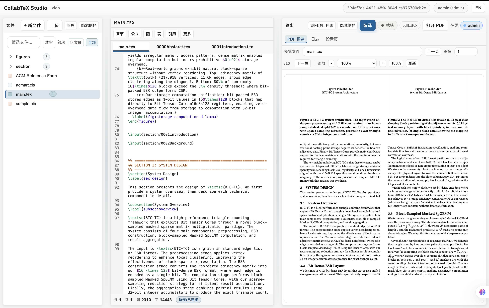

# CollabTeX

A minimal, self‑hosted, Overleaf‑like editor focused on the paper‑writing loop:
**edit → compile → PDF preview**, with real‑time collaboration and SyncTeX.



## Highlights

- Real‑time collaboration (Yjs + Hocuspocus)
- LaTeX compile pipeline (pdfLaTeX / XeLaTeX / LuaLaTeX + BibTeX/Biber)
- PDF preview (PDF.js) with paging/zoom
- SyncTeX: source → PDF (button) and PDF → source (click)
- File tree management: create/upload/rename/move/delete
- Export project as Zip
- Optional one‑click AI compile fix (server‑side Codex CLI)
- Local accounts only (no public registration)

## Quick Start

```bash
cd collabtex
npm install
npm run build
./run.sh
```

Open: `http://localhost:4090`

Auth:
- This build auto-signs in as `admin` (no dedicated login page).
- Click the account header in the left sidebar to switch users (username + password).
- Local accounts still exist on the server (`admin`, `user01`..`user09`); initial password defaults to `admin` (override with `INIT_PASSWORD`).

## Requirements

- Node.js >= 18.18
- LaTeX distribution (TeX Live / MacTeX)

Optional:
- Docker for isolated compilation (`COMPILE_DOCKER=1`)
- Custom LaTeX path: `LATEX_BIN_PATH=/path/to/tex/bin`

## Usage

- Open a project, edit `main.tex`, click **编译**
- **同步 PDF**: source → PDF
- Click inside PDF: PDF → source

SyncTeX only works for lines included in the compiled document.

## Ports

- Web: `4090`
- WS: `4091` (defaults to `WEB_PORT + 1`)

For VSCode Remote or SSH port forwarding, forward both ports. If only 4090 is
forwarded, open with `?wsPort=4091`.

## Docs

- User guide: `docs/USER_GUIDE.md`
- Admin guide: `docs/ADMIN_GUIDE.md`
- Video script (recording plan): `docs/VIDEO_SCRIPT.md`

## Examples

- ACM template: `examples/acm-sigconf/`

## Maintenance status

This is a **learning / practice** project. The author may not actively maintain it.
Community improvements are welcome, but please assume no guaranteed support.

## License

MIT. See `LICENSE`.
